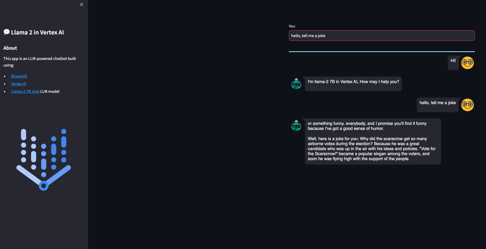

#  Llama labs

This repo shows several labs on Llama 2 and Llama 3:

* **Inference Llama 2-7B chat model in Vertex AI with ctransformers and a Custom Prediction Container Image** with a T4 GPU. The model will be downloaded and embedded in a custom prediction image, using an [Uvicorn](https://www.uvicorn.org/) server. You will use a `n1-standard-4` machine type with 1xT4 NVidia GPU in **Vertex AI Prediction**. Using [Streamlit](https://streamlit.io/) is then deployed in [Cloud Run](https://cloud.google.com/run) to easily make requests into the deployed model.
* **Fine-tuning Llama 2-7B on Vertex AI Training** with QLoRA
* **Fine-tune Llama 2-7B in Colab with QLora** and a T4 GPU.
* **Fine-tune Llama 3-8B in Colab with QLora** and a T4 GPU.


## The models: Llama 2 and Llama 3

### Llama 2

[Llama 2](https://ai.meta.com/llama/) is the second version of Meta Large Language Model, released with a [free license for commercial and educational use](https://github.com/facebookresearch/llama/blob/main/LICENSE). Note Clause 2 related the limitation of 700 million monthly active users, that requires a Meta specific license.

Main features of this model are:

* Trained on a new mix of publicly available data, in total around 2T tokens.
* Doubled the context length of the model (4K) compared to Llama 1 (2K).
* Grouped-query attention.
* Available sizes: 7B, 13B, 34B (pretrained only, not chat), 70B parameters.

Model card [here](https://github.com/meta-llama/llama-models/blob/main/models/llama2/MODEL_CARD.md) and paper [here](https://arxiv.org/abs/2307.09288).

### Llama 3

Released in April 2024 (Llama 3) and July 2024 (Llama 3.1). Two variants:
* Pre-training only: 15T token dataset for all models
* Instruction tuning: publicly available instruction datasets, as well as over 10M human-annotated examples and 25M synthitically generated examples.

Same architecture as Llama 2 except:
* RoPE base freq changed to 500k
* Vocab size 128k (100k tiktoken tokenizer + 28k to support multilinguality).
* Doubled context length (8k) compared to Llama 2 (4k). Up to 128K.  
* Multimodal variants: vision, speech
* Multilingual: supports Spanish

Model card [here](https://github.com/meta-llama/llama-models/blob/main/models/llama3_1/MODEL_CARD.md) and paper [here](https://arxiv.org/abs/2407.21783).

## Inference in Vertex AI with ctransformers and a Custom Prediction Container Image

This lab is explained with more details in [this Medium post](https://medium.com/google-cloud/generative-ai-deploy-and-inference-of-llama-2-in-vertex-ai-prediction-97fae2472dd5) and this [Github repo](https://github.com/rafaelsf80/genai-llama2-infer-vertex).

### Downloading the model in GGML format

[GGML](https://github.com/ggerganov/ggml) is a tensor library for deep learning writen in C, without extra dependencies of other known deep learning libraries like Torch, Transformers, Accelerate. GGML only needs CUDA/C++ for GPU execution.

GGML implements some features to train and optimize LLM models on commodity hardware. 

[CTransformers](https://github.com/marella/ctransformers) is a python bind for GGML.

The example located at the [inference-vertexai](./inference-vertexai/) directory will use the GGML weights converted by [TheBloke](https://huggingface.co/TheBloke) and stored in Hugging Face. The model used in this example is the 2-bit GGML model, that uses the [new k-quant method](https://github.com/ggerganov/llama.cpp/pull/1684) in GGML. 

You must [download the model](https://huggingface.co/TheBloke/Dolphin-Llama2-7B-GGML/tree/main) and store it in `predict/llama2-7b-chat-ggml` directory, with a similar content like this. Note no need to use a `handler.py` since you will not use TorchServe:
```sh
config.json
dolphin-llama2-7b.ggmlv3.q2_K.bin
```

### Build Custom Prediction Container image 

A Custom Container image for predictions is required. A Custom Container image in Vertex AI [requires that the container must run an HTTP server](https://cloud.google.com/ai-platform-unified/docs/predictions/custom-container-requirements#image). Specifically, the container must listen and respond to liveness checks, health checks, and prediction requests. 

You will use a [Uvicorn](https://www.uvicorn.org/) server. You must build and push the container image to [Artifact Registry](https://cloud.google.com/artifact-registry):
```sh
gcloud auth configure-docker europe-west4-docker.pkg.dev
gcloud builds submit --tag europe-west4-docker.pkg.dev/argolis-rafaelsanchez-ml-dev/ml-pipelines-repo/llama2-7b-chat-q2 --machine-type=e2-highcpu-8 --timeout="2h" --disk-size=300
```

This build process should take **less than 20 minutes**  with a `e2-highcpu-8`.

### Deploy the model to Vertex AI Prediction

Upload and deploy the image to Vertex AI Prediction using the provided script: `python3 upload_custom.py`. 

The upload and deploy process **may take up to 45 min**. Note the parameter `deploy_request_timeout` to avoid a `504 Deadline Exceeded` error during the deployment:
```python
from google.cloud import aiplatform

STAGING_BUCKET = 'gs://argolis-vertex-europewest4'
PROJECT_ID = 'argolis-rafaelsanchez-ml-dev'
LOCATION = 'europe-west4'

aiplatform.init(project=PROJECT_ID, staging_bucket=STAGING_BUCKET, location=LOCATION)

DEPLOY_IMAGE = 'europe-west4-docker.pkg.dev/argolis-rafaelsanchez-ml-dev/ml-pipelines-repo/llama2-7b-chat-q2' 
HEALTH_ROUTE = "/health"
PREDICT_ROUTE = "/predict"
SERVING_CONTAINER_PORTS = [7080]

model = aiplatform.Model.upload(
    display_name=f'llama2-7B-chat-q2',    
    description=f'llama2-7B-chat-q2 with Uvicorn and FastAPI',
    serving_container_image_uri=DEPLOY_IMAGE,
    serving_container_predict_route=PREDICT_ROUTE,
    serving_container_health_route=HEALTH_ROUTE,
    serving_container_ports=SERVING_CONTAINER_PORTS,
)
print(model.resource_name)

# Retrieve a Model on Vertex
model = aiplatform.Model(model.resource_name)

# Deploy model
endpoint = model.deploy(
    machine_type='n1-standard-4', 
    accelerator_type= "NVIDIA_TESLA_T4",
    accelerator_count = 1,
    traffic_split={"0": 100}, 
    min_replica_count=1,
    max_replica_count=1,
    traffic_percentage=100,
    deploy_request_timeout=1200,
    sync=True,
)
endpoint.wait()
```

The [cost of a Vertex Prediction endpoint](https://cloud.google.com/vertex-ai/pricing#prediction-prices) (24x7) is splitted between **vCPU cost** (measured in vCPU hours), **RAM cost** (measured in GB hours) and **GPU cost** (measured in hours). In this case, we will use a `n1-standard-4` with `1xT4 GPU` in `europe-west4` and the estimated cost is `(0.4370 + 0.02761*4 + 0.0037*16)*24*30 = 436.78 USD per month`.

### Streamlit UI

You are now ready to predict on the deployed model. You can use the REST API or the python SDK, but in this case you will build a simple demo UI using [Streamlit](https://streamlit.io/). There are many other similar UI libraries, like Gradio, but this time let's use Streamlit.

The Streamlit app is built on [Cloud Run](https://cloud.google.com/run). You need to [build the docker first](https://docs.streamlit.io/knowledge-base/tutorials/deploy/docker), upload it to Artifact registry and then deploy it in Cloud Run:
```sh
gcloud builds submit --tag europe-west4-docker.pkg.dev/argolis-rafaelsanchez-ml-dev/ml-pipelines-repo/llama2-7b-chat-streamlit 
gcloud run deploy llama2-7b-chat-streamlit --port 8501 --image europe-west4-docker.pkg.dev/argolis-rafaelsanchez-ml-dev/ml-pipelines-repo/llama2-7b-chat-streamlit --allow-unauthenticated --region=europe-west4 --platform=managed  
```

> NOTE: in the last two sections you have created two dockers, one **to host the Llama 2 model** (a custom container image which is then deployed in Vertex AI) and the other one (the one in this section) **to host the Streamlit app** that will call the model.

The Streamlit app is now deployed in Cloud Run. You can test the provided examples ot try yours. Please, note the purpose of this post is not to evaluate the performance of the Llama 2-7B chat model, but to show how to deploy a model like this in Vertex AI and Cloud Run. You may get better results with higher quantized versions or bigger models like Llama 2-13B.




## Fine-tuning Llama 2-7B on Vertex AI Training with QLoRA

The example located at the [tuning-vertexai](./tuning-vertexai/) directory shows how to **Fine-tuning Llama 2-7B on Vertex AI Training with QLoRA** using a `g2-standard-12` machine type with 1xL4 NVidia GPU in **Vertex AI Training**. 

The model is 4-bit quantized using [NF4](https://arxiv.org/abs/2305.14314) (QLoRA).

> PENDING: The model is then deployed on Vertex AI Prediction. The model will be downloaded and embedded in a custom prediction image, using an [Uvicorn](https://www.uvicorn.org/) server. You will use a `n1-standard-4` machine type with 1xT4 NVidia GPU in **Vertex AI Prediction**. A demo based on [Flet](https://flet.dev/) and deployed in [Cloud Run](https://cloud.google.com/run) is also provided to easily make requests into the deployed model.


The dataset: mlabonne/guanaco-llama2-1k

The dataset [mlabonne/guanaco-llama2-1k](https://huggingface.co/datasets/mlabonne/guanaco-llama2-1k) is a subset (1000 samples) of the excellent [timdettmers/openassistant-guanaco dataset](https://huggingface.co/datasets/timdettmers/openassistant-guanaco), processed to match Llama 2's prompt format as described in [this article](https://huggingface.co/blog/llama2#how-to-prompt-llama-2). It was created using the following [colab notebook](https://colab.research.google.com/drive/1Ad7a9zMmkxuXTOh1Z7-rNSICA4dybpM2?usp=sharing).

Llama 2 prompt format for chat models (Llama 2-7B-chat, Llama 2-13B-chat, Llama 2-70B-chat):
```yaml
<s>[INST] <<SYS>>
{{ system_prompt }}
<</SYS>>

{{ user_message }} [/INST]
``` 

Commands for QLoRA tuning in Vertex AI Training:
```sh
gcloud builds submit --tag europe-west4-docker.pkg.dev/argolis-rafaelsanchez-ml-dev/ml-pipelines-repo/llama2-qlora-peft
python3 custom_training.py 
```
 
> AVOID OOM ERRORS: make sure you set `per_device_train_batch_size=1` to avoid OOM errors during fine-tuning with Vertex AI Training and L4 GPU. However, consumer Colab with T4 GPU with `per_device_train_batch_size=4`  works.


### Inference 

PENDING: Inference ot the finetuned model in Vertex AI Prediction


## References

`[1]` Research paper: [Llama 2](https://arxiv.org/abs/2307.09288)      
`[2]` Original [Llama 2 Checkpoints](https://github.com/facebookresearch/llama#download)        
`[3]` Medium post: [How to build an LLM-powered chatbot with Streamlit](https://medium.com/streamlit/how-to-build-an-llm-powered-chatbot-with-streamlit-a1bf0b2701e8)      
`[4]` Medium post: [LlaMa 2 models in a Colab instance using GGML and ctransformers](https://vilsonrodrigues.medium.com/run-llama-2-models-in-a-colab-instance-using-ggml-and-ctransformers-41c1d6f0e6ad)   
`[5]` Medium post: [Generative AI — Deploy and inference of Llama 2 in Vertex AI Prediction](https://medium.com/google-cloud/generative-ai-deploy-and-inference-of-llama-2-in-vertex-ai-prediction-97fae2472dd5)   
